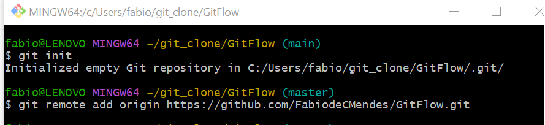
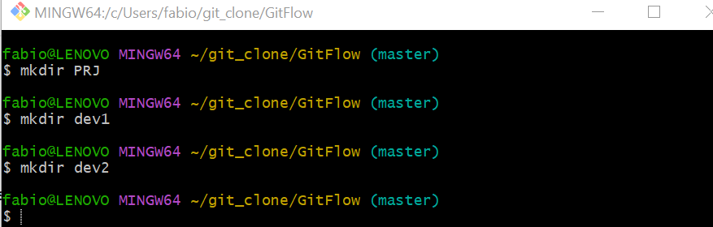
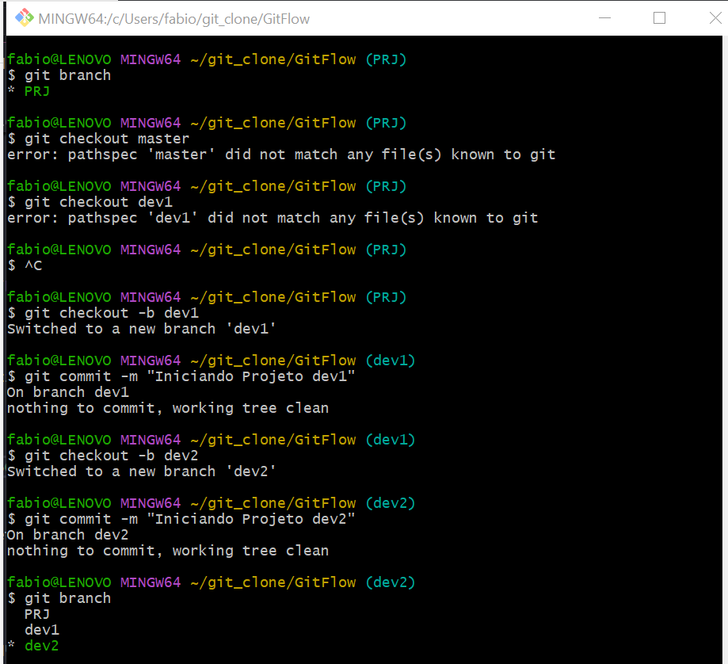
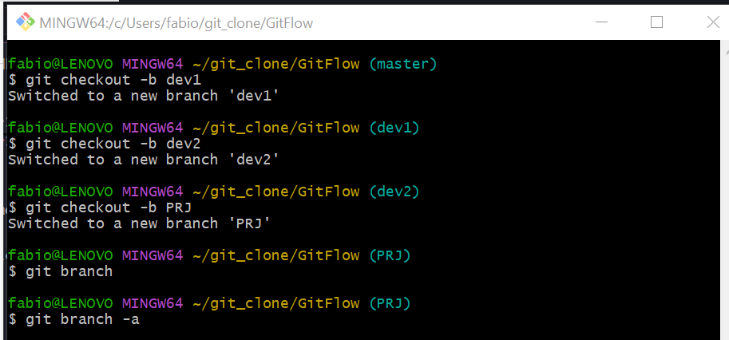
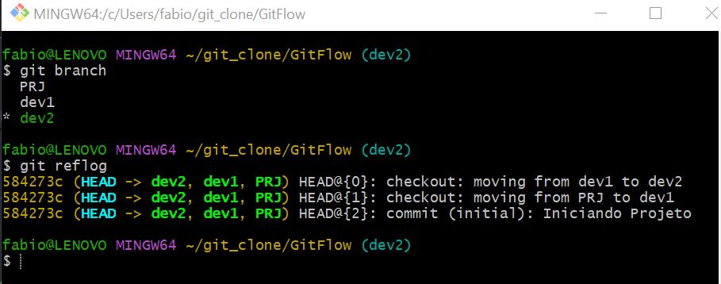
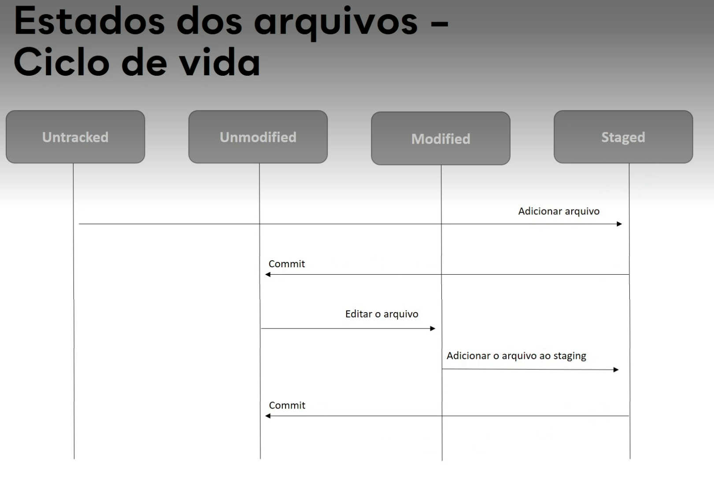

<body>
    <h1>Git/GitHub</h1>

<p><b>Git</b> é um sistema de controle de versão, ou seja ele registra e gerencia todas as mudancas feitas dentro de um repositorio.</p>


<a href="https://www.youtube.com/watch?v=XlV_8Q4Uli8&list=PLHWfNMxB2F4Gn--hEMkiJOlqOVr-lms8O" target="_blank">💻 </a></br>


<p><b>Repositorio</b> é o local onde os arquivos de um projeto são armazenados, podem ser local (seu computador) ou remoto (compartilhado github).</p>
<a href="https://git-scm.com/book/pt-br/v2/Fundamentos-de-Git-Gravando-Alterações-em-Seu-Repositório" target="_blank">✏️fundamentos</a></br>


<p>o gerenciamento é feito via execução de comandos que registram as mudanças.</p>


<p><b>Branch</b> é uma linha de desenvolvimento separada e independente, funcionando como um "ponteiro móvel" para um commit específico.</p>

<a href="https://git-scm.com/book/pt-br/v2/Branches-no-Git-Branches-em-poucas-palavras" target="_blank">✏️o que é branch </a></br>


<p>A criação de branches ajuda a proteger o projeto principal e permite trabalhos em paralelos (ramificações) que posteriormente podem ser atualizados na branch principal se validados com sucesso.</p>

</br>
<p><b>Principais conceitos/beneficios de uma branch:</b></p>
</br></br>
<p>- <b>Isolamento:</b> Permite trabalhar em múltiplas funcionalidades simultaneamente sem conflitos entre equipes.</br>
- <b>Ponteiro para Commit:</b> Tecnicamente, uma branch não é uma cópia física dos arquivos, mas um ponteiro leve que aponta para o último commit realizado naquele "ramo".</br>
- <b>Merge:</b>Quando o trabalho na branch é finalizado, ele é integrado (mergeado) de volta ao ramo principal.</br>
- <b>Rapidez:</b> Criar e alternar entre branches no Git é quase instantâneo, tornando o fluxo de trabalho muito eficiente</br>
</p>

</br>
<h3><b>#Workflow básico GitFlow Git</b></h3></br>

criar Projeto exemplo "Gitflow" no gitHub- (Diretorio Principal)</br>

nome : GitFlow

Diretorio gerado no github:
https://github.com/FabiodeCMendes/GitFlow.git

Exemplo de utilização compartilhada do git/ Github para desenvolvimento de projetos em paralelo

<p>
O comando <b>git remote add origin</b> serve para conectar o seu repositório local a um repositório na nuvem (como o GitHub ou GitLab). Ele cria um "atalho" chamado origin que aponta para a URL do seu projeto, permitindo que você envie (push) ou baixe (pull) códigos da interne </p></br>
<p><b>>git remote add origin https://github.com/FabiodeCMendes/GitFlow.git</b></p></br>

<p>O comando <b>git push --set-upstream origin master</b> envia seus arquivos do computador local para a nuvem e cria uma ligação permanente entre eles.</br>
<b>>git push --set-upstream origin master</b></p></br>

```markdown
**"git push"** : Envia os seus commits locais para um repositório online (como o GitHub ou GitLab).
**"--set-upstream (ou apenas -u)"** : Cria um vínculo (rastreamento) entre a sua branch atual e a branch remota.
**"origin"** : É o nome padrão que o Git dá ao endereço do seu repositório remoto na internet.
**"master"**: É o nome da ramificação (branch) do seu projeto
```

<p>mostra a situacao do projeto/repositorio</br>
<b>>git status</b></p></br>

<p>inclui um arquivo para ser monitorado no projeto git (repositorio)</br>
<b>>git add <nome_arquivo> </b></br>
<p>inclui todos arquivo pendentes para ser monitorado no projeto git (repositorio)</br>
<b>>git add .</b></p></br>

<b>criar repositorio Principal</b></br>
<b>>mkdir "PRJ"</b></br>
<p>criar repositorio para desenvolvedor 1</br>
<b>>mkdir dev1</b></p></br>
<p>criar repositorio para desenvolvedor 2</br>
<b>>mkdir dev2</b></p></br>

</br>

<h3>>criar branches (ramificações) para desenvolvimento em paralelo.</h3>

<b>>git branch nome-da-branch</b></p></br>

<p>criar branch principal (será considerada a oficial do projeto para produção)</br>
<b>>git branch PRJ</b></p></br>

<p>criar branch do desenvolverdor 1</br>
<b>>git branch dev1</b></p></br>

<p>criar branch do desenvolverdor 2</br>
<b>>git branch dev2</b></p></br>




<h3>Listar as branchs criadas</h3>

<p>Ver branches locais:</br>
<b>>git branch</b></p></br>

<p>Ver todas as branches (locais e remotas)</br>
<b>>git branch -a</b></p></br>

<p>deletar uma branch
<b>>git branch -d nome-da-branch</b>
<b>>git branch -d dev3 </b></p></br>

<p>para mudar o ponteiro para uma outra branch utilize o comando:</br>
<b>>git checkout "NomeDaBranch"</b></br>
<b>>git checkout dev1</b></p></br>


<p></p></br>

<p>para criar e mudar o ponteiro para uma outra branch utilize o comando:</br>
<b>>git checkout -b "NomeDaBranch"</b></br>
<b>>git checkout -b devX</b></p></br>

```markdown

  **git checkout** : Comando para alternar entre branches ou restaurar arquivos.</br>
  **-b** : Flag que força a criação de uma nova branch.</br>
  **NomeDaBranch** : O nome que você escolheu para a sua nova branch.</br>
  **master** : A branch de origem (sua nova branch será uma cópia idêntica da master neste momento).</br>
```

<p>verificar o historico das versões :</br>
<b>>git reflog </b></p></br>


<p>retornar/restaurar versao especifica do historico das versões :</br>
<b>>git reset --hard "numero_do_ID"</b><br>
<b>>git reset --hard 584273c </b></p><br>


----------------------------------------------------------------

>git remote add origin ...

>git push -u origin main

>git pull

>git clone https://github.com/CONTA/repositorio.git

remove repositorio "CONTA"
>rm -rf CONTA/

<h3>Sincronização git e Github

lista a conta/repositorio que esta em uso (apontada)
>git remote -v
(fetch) = 
(push) = 


>git remote rename origin upstream

>git remote add origin git@github.com:CONTA/repositorio

>

----------------------------------------------------------------


atualiza a branch com a ultima versao oficial remota
>git pull
atualiza
>git merge <branch_alterada_ok>
envia a alteracao para o repositorio remoto
>git push

<h4>pull request</h4>

<h4>git ignore</h4>
>touch .gitignore


>git show


cria abreviatuaras para comando


git fetch: Apenas baixa os metadados do servidor para você inspecionar.
 importa commits para ramificações locais, enquanto o comando push exporta commits para ramificações remotas
>git fetch origin
https://git-scm.com/docs/git-fetch
https://www.atlassian.com/br/git/tutorials/syncing/git-fetch

O comando git push é usado para enviar o conteúdo do repositório local para um repositório remoto.
>git push
https://git-scm.com/docs/git-push
https://www.atlassian.com/br/git/tutorials/syncing/git-push


git pull: Executa um git fetch e, em seguida, aplica um git merge automaticamente, forçando a inclusão das alterações no seu código na mesma hora
>git pull origin
https://git-scm.com/docs/git-pull
https://www.atlassian.com/br/git/tutorials/syncing/git-pull


git Merge: Mesclagem é o jeito do Git de unificar um histórico bifurcado
>git merge
https://www.atlassian.com/br/git/tutorials/using-branches/git-merge

https://www.atlassian.com/br/git/tutorials/using-branches/merge-conflicts
https://www.atlassian.com/br/git/tutorials/using-branches/merge-strategy


entrar no repositorio principar e iniciar o projeto</br>
<b>>cd PRJ</b></br>
<b>>git init --bare</b></br>
criar arquivo inicial do projeto </br>
<b>>vim historico.txt</b></br>
incluir uma linha no arquivo com uma informação qualquer ex. "projeto iniciado" e fechar
confira a criação  com o comando abaixo</br>
<b>>git status</b></br>
o arquivo estara como "untracked" = não "vigiado pelo git"</br>
</br>
para inclui-lo no projeto execute :</br>
<b>>git add historico.txt</b></br>
o arquivo alterará o status para "to unstage" = "vigiado'</br>
agora confirme a alteração do projeto com o comando commit e inclua uma mensagem de controle</br>
<b>>git commit -m "primeiro commit do projeto"</b></br>

o comando remote mostra para onde voce pode enviar o projeto alterado</br>
<b>>git remote -v</b></br>
origin(fetch)</br>
origin(push)</br>

envio/atualize o projeto no branch master</br>
<b>>git push origin master</b></br>


clonar o repositorio principal para o dev1</br>
<b>>cd ..</b></br>
<b>>cd dev1</b></br>
<b>>git clone /git/PRJ/</b></br>

voce vai verificar que o projeto clonado ja contem o arquivo "historico.txt"</br>
edite o arquivo e inclua mais uma linha</br>
<b>>vim historico.txt</b></br>
incluir uma linha nova linhano arquivo com uma informação qualquer ex. "Dev1 entrou no projeto" e feche e commit a alteração</br>
<b>>git add historico.txt</b></br>
>git commit -m "dev1 iniciado"</b></br>


clonar o repositorio principal para o dev2</br>
<b>>cd ..</b></br>
<b>>cd dev2</b></br>
<b>>git clone /git/PRJ/</b></br>
voce vai verificar que o projeto clonado ja contem o arquivo "historico.txt"</br>
edite o arquivo e inclua mais uma linha</br>
<b>>vim historico.txt</b></br>
incluir uma linha nova linhano arquivo com uma informação qualquer ex. "Dev2 entrou no projeto" e feche e commit a alteração</br>
<b>>git add historico.txt</b></br>
obs:
<b>>git add . "(adiciona todos os arquivos pendentes de uma só vez)"</b></br>
commit o projeto novamente</br>
<b>>git commit -m "dev2 iniciado"</b></br>


voltar para o dev1 verifique o status e o arquivo. vera que nao esta atualizado</br>
<b>>cd ..</b></br>
<b>>cd dev1</b></br>
<b>>git status</b></br>
<b>>vim historico.txt</b></br>
voce vai verificar que o arquivo não esta atualizado com o ultimo comit do dev2, 
para atualizar importe o projeto novamente com o comando pull,as atualizaçoes do projeto sincronizadas.</br>
<b>>git pull origin master</b></br>

após o pull verifique a sincronização:</br>
<b>>git status</b></br>
<b>>vim historico.txt</b></br>

</br>
<b>Branch e Merges</b></br>
<a href="https://youtu.be/3HAEriAk3-c?list=PLHWfNMxB2F4Gn--hEMkiJOlqOVr-lms8O" target="_blank">💻Branch e Merges </a></br>


</br>
#Ciclo de vida de um arquivo </b></br>
 

ex:<a href=" https://git-scm.com/book/pt-br/v2/Fundamentos-de-Git-Gravando-Alterações-em-Seu-Repositório" target="_blank">✏️fundamentos </a></br>


</br>
<h2>Comandos</h2> </br>

    git config --global user.name "FabiodeCMendes"
    git config --global user.email "fabio@email.com"
    git config --global core.editor "vscode"
    git config --global core.editor "vim" 
    
  
  
<p>
PS = PowerShell
PS C:\Users\fabio\git_clone\git\imgs>
> git clone https://github.com/FabiodeCMendes/git.git
</p>
 


-- Controle de versão distribuido
Commits -
Branches -
Merge - 

<h2>biblioteca on line - GitHub, GitLab, Bitbucket</h2>
-  <strong>repositorio local </strong>
-  <strong>repositorio remoto</strong>
- <strong>Pull Request</strong> - Enviar solicitações para integrar mudanças em um projeto principal, facilitando a colaboração e revisão e aprovação de código.

-  <strong>Fork </strong>
-  <strong>Clone</strong>
<p>
<strong>Issues</strong> - Ferramenta de rastreamento de problemas e tarefas em projetos de software, permitindo que os desenvolvedores registrem, organizem e acompanhem bugs, melhorias e solicitações de recursos.
</p>

       git init
       git add .
       git commit -m "first commit" 
       git branch -M main
       git remote add origin
       git push -u origin main

    

</body>
</html>
