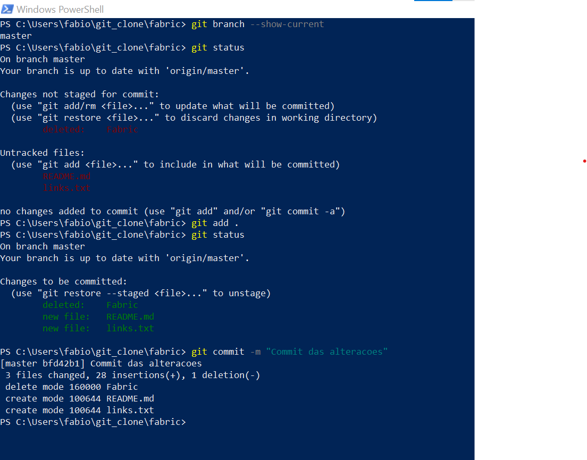
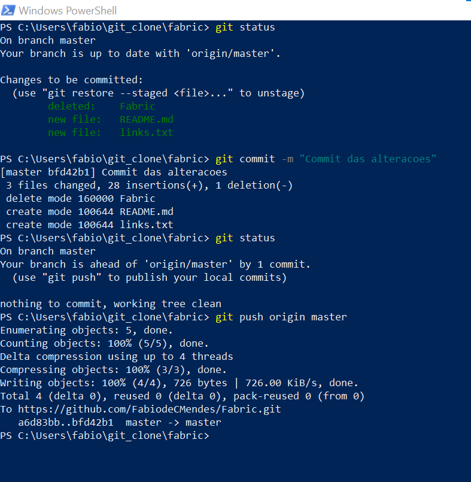
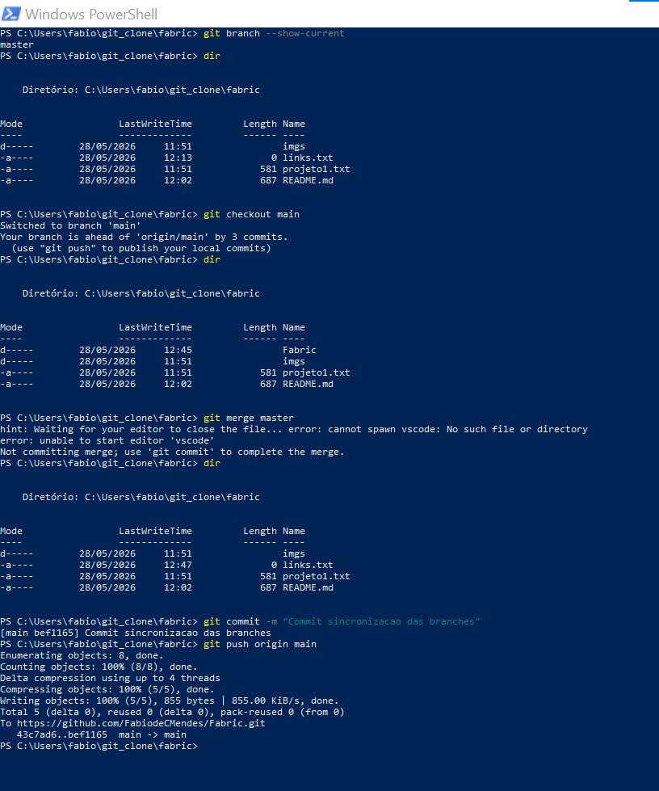

> git clone https://github.com/FabiodeCMendes/Fabric.git
> git remote add origin https://github.com/FabiodeCMendes/Fabric.git

Inicia o git
>git init

Mostrar a Branch atual
>git branch --show-current

Mostrar todas as Branch local
>git branch -a

Alternar entre branches(ramificações)ou criar novas branches.
>git checkout master
>git checkout main
>git checkout dev1

Mostra o status do branch
>git status

Use *git pull* antes de começar a trabalhar:  
Isso garante que você está escrevendo código em cima da versão mais recente do projeto, evitando conflitos com o trabalho dos seus colegas.  
Use *git pull* quando você já sabe que o servidor tem atualizações seguras e quer atualizar o seu código local imediatamente para continuar trabalhando.  
Para Garantir que a branch local esta igual a remota:
>git checkout master
>git pull origin master
 

Cataloga um arquivo no git
>git add nome-do-arquivo.txt

Cataloga varios arquivo no git
>git add .

Efetiva as alterações
>git commit -m "Commit das alteracoes"

## Subir as alterações da branch local para a remota:

Use *git push* após finalizar e buildar sua tarefa:  
Assim que você fizer suas alterações e criar um commit localmente, use o comando para salvar o progresso de forma segura na nuvem.
>git push origin master
>git push origin main

## Sincronizar Branches
Atualizar a branch main com o conteúdo da master  

1. na branch master, baixe as atualizações do servidor.
>git checkout master
>git pull origin master

2. Mude para a branch main,puxe as atualizações dela também (por segurança):
>git checkout main
>git pull origin main 

3. Junte (faça o merge) da master dentro da main
>git merge master

4.Envie a main atualizada de volta para o servidor remoto
>git push origin main

## Comparar as diferenças de código (Conteúdo)
>git diff
>git diff --name-status main..master

M: Arquivo modificado.  
A: Arquivo adicionado.  
D: Arquivo deletado.  

## Git log
Comparar a lista de commits entre as branches  
Caso queira ver o histórico de mensagens de commits que existem em uma branch, mas não na outra, utilize o comando *git log*
>git log main..master --oneline

Use *git fetch* quando quiser ver o progresso da equipe, checar novas ramificações (branches) ou revisar o código antes de atualizar o seu.
>git fetch origin

