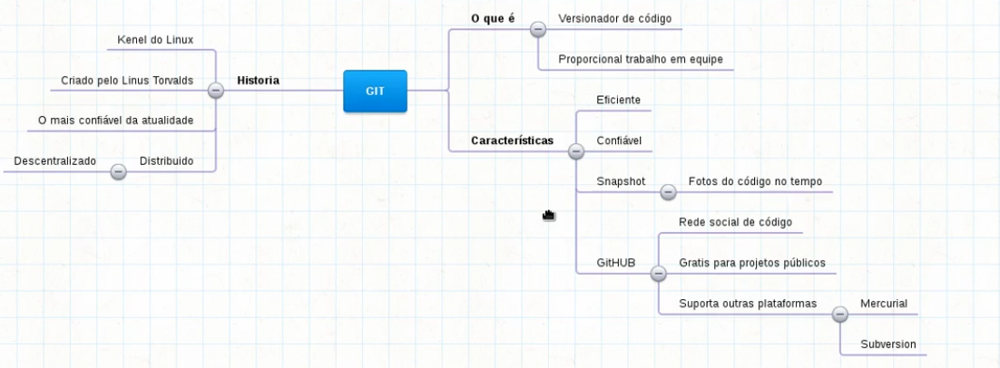
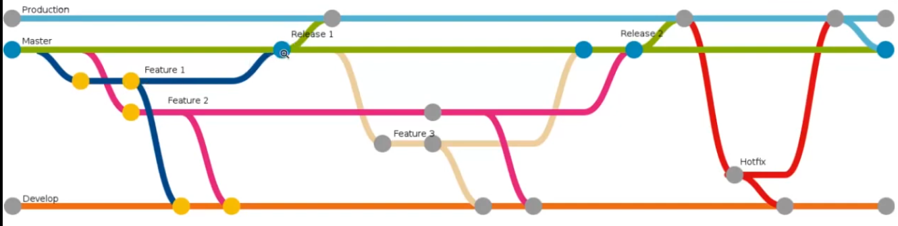
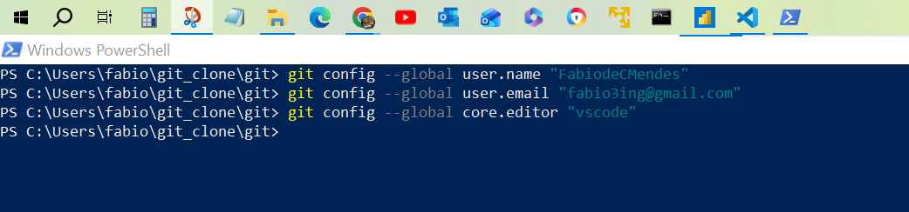
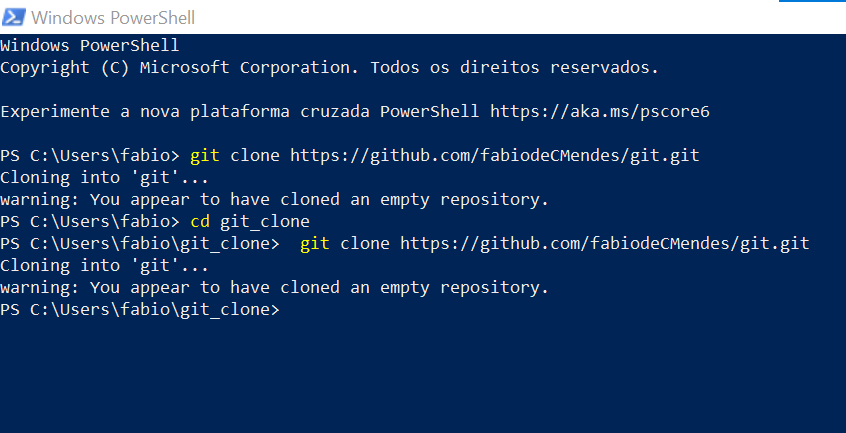

<body>
    <h1>Git/GitHub</h1>

<b>b>Git</b> é um sistema de controle de versão, ou seja ele registra e gerencia todas as mudancas feitas dentro de um repositorio.

<a href="https://www.youtube.com/watch?v=XlV_8Q4Uli8&list=PLHWfNMxB2F4Gn--hEMkiJOlqOVr-lms8O" target="_blank">💻 </a> 

<b>Repositorio</b> é o local onde os arquivos de um projeto são armazenados, podem ser local (seu computador) ou remoto (compartilhado github).

<a href="https://git-scm.com/book/pt-br/v2/Fundamentos-de-Git-Gravando-Alterações-em-Seu-Repositório" target="_blank">💻 </a> 

o gerenciamento é feito via execução de comandos que registram as mudanças.

<b>Branch</> é uma linha de desenvolvimento separada e independente, funcionando como um "ponteiro móvel" para um commit específico.

<a href="https://git-scm.com/book/pt-br/v2/Branches-no-Git-Branches-em-poucas-palavras" target="_blank">💻 </a> 

A criação de branches ajuda a proteger o projeto principal e permite trabalhos em paralelos (ramificações) que posteriormente podem ser atualizados na branch principal se validados com sucesso.

Principais conceitos/beneficios de uma branch:

- Isolamento: Permite trabalhar em múltiplas funcionalidades simultaneamente sem conflitos entre equipes.
- Ponteiro para Commit: Tecnicamente, uma branch não é uma cópia física dos arquivos, mas um ponteiro leve que aponta para o último commit realizado naquele "ramo".
- Merge: Quando o trabalho na branch é finalizado, ele é integrado (mergeado) de volta ao ramo principal.
- Rapidez: Criar e alternar entre branches no Git é quase instantâneo, tornando o fluxo de trabalho muito eficiente

#Workflow básico GitFlow Git
#Ciclo de vida de um arquivo 

ex:<a href=" https://git-scm.com/book/pt-br/v2/Fundamentos-de-Git-Gravando-Alterações-em-Seu-Repositório" target="_blank">💻 </a> 

<h2>Comandos</h2> 
    
git config --global user.name "FabiodeCMendes" 
       git config --global user.email "fabio@email.com" 
       git config --global core.editor "vscode" 
       git config --global core.editor "vim"  
    
 
       
     

PS = PowerShell
PS C:\Users\fabio\git_clone\git\imgs>
> git clone https://github.com/FabiodeCMendes/git.git

 

-- Controle de versão distribuido
Commits -
Branches -
Merge - 

<h2>biblioteca on line - GitHub, GitLab, Bitbucket</h2>
-  <strong>repositorio local </strong>
-  <strong>repositorio remoto</strong>
- <strong>Pull Request</strong> - Enviar solicitações para integrar mudanças em um projeto principal, facilitando a colaboração e revisão e aprovação de código.

-  <strong>Fork </strong>
-  <strong>Clone</strong>

<strong>Issues</strong> - Ferramenta de rastreamento de problemas e tarefas em projetos de software, permitindo que os desenvolvedores registrem, organizem e acompanhem bugs, melhorias e solicitações de recursos.

       git init
       git add .
       git commit -m "first commit" 
       git branch -M main
       git remote add origin
       git push -u origin main

    

   <h2>Bibliotecas:</h2>
   <a href="https://git-scm.com/book/en/v2" target="_blank">Manual em Inglês </a> 
   <a href="https://git-scm.com/book/pt-pt/v2" target="_blank">Manual em Português </a> 

    <h2>Vídeo recomendado</h2>

 
    <a href="https://www.youtube.com/watch?v=3-3gGSrWd00" target="_blank">💻COMO UTILIZAR O GITHUB COM VSCODE SEM ENROLAÇÃO</a> 
    <a href="https://www.youtube.com/watch?v=6DCmCjYRrLU" target="_blank">💻Seu Primeiro Repositório no GitHub (e Como Usar com VS Code) </a> 
    <a href="https://www.youtube.com/watch?v=B2WKfie1Xtk&t=13s" target="_blank">💻GitHub Copilot no VS Code!</a> 
    <a href="https://www.youtube.com/watch?v=8U43SrcHCHU" target="_blank">💻Workflow básico GitFlow Git </a> 
    <a href="https://www.youtube.com/watch?v=iOJV_9JWqQ4&t=133s" target="_blank">💻 Estado dos arquivos no git </a> 
             
    <!-- <a href="" target="_blank">💻 </a>  --> 

</body>
</html>
